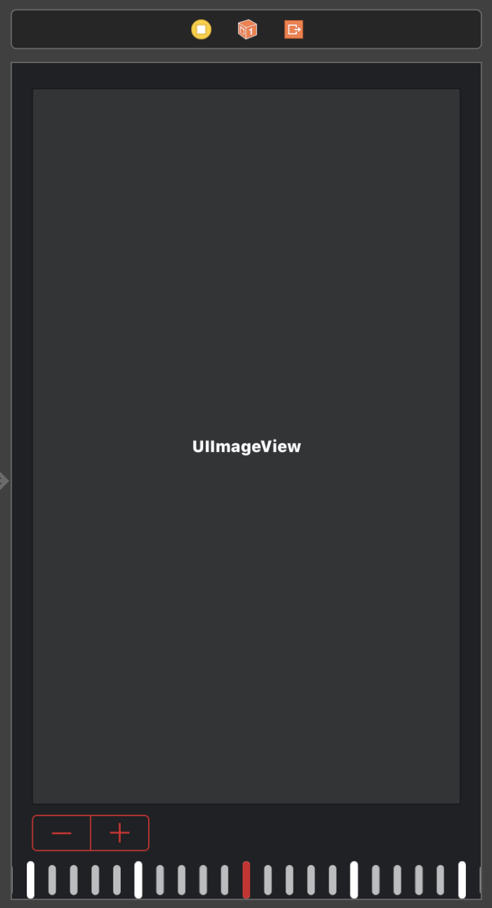
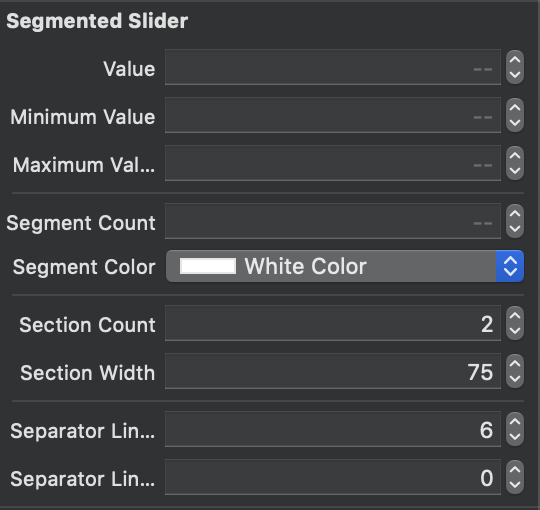
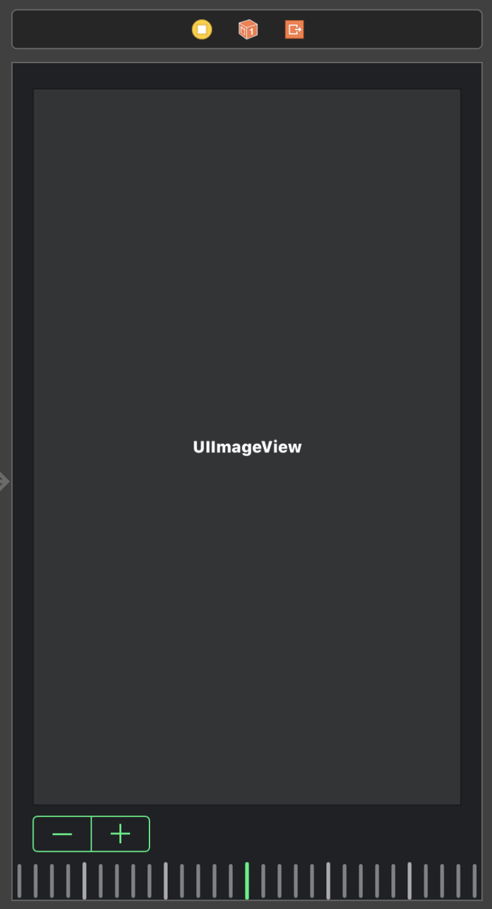
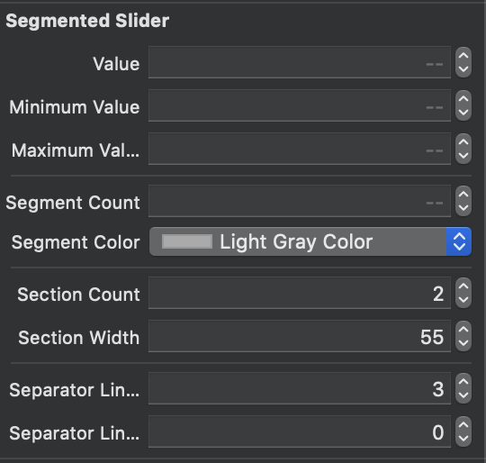

# SegmentedSlider

`SegmentedSlider` is a fully customizable, dial-like UI element to pick a single value from a continuous range of values. It uses `CoreAnimation` to provide maximum performance with minimum **GPU**/**CPU** and battery usage.

[](https://github.com/vahan3x/SegmentedSlider/releases)
[](https://swift.org)
[](https://github.com/vahan3x/SegmentedSlider/blob/master/LICENSE?raw=true)
[](https://cocoapods.org/pods/SegmentedSlider)
[](https://github.com/Carthage/Carthage)
_____

- [SegmentedSlider](#segmentedslider)
    - [Example](#example)
    - [Requirements](#requirements)
    - [Installation](#installation)
        - [CocoaPods](#cocoapods)
        - [Carthage](#carthage)
        - [Manually](#manually)
        - [Embedded Framework](#embedded-framework)
    - [License](#license)

## Example

To run the example project, clone the repo, and open `SegmentedSlider.xcworkspace` from the root directory.

### Screenshots

&nbsp;

&nbsp;



## Requirements

- iOS 10.0+
- Xcode 9.0+
- Swift 4.2+

## Installation

### CocoaPods

[CocoaPods](https://cocoapods.org) is a dependency manager for Cocoa and Cocoa Touch projects. You can install it with the following command:

```bash
$ gem install cocoapods
```

> CocoaPods 1.5.0+ is required to build SegmentedSlider 1.0.0+.

To integrate SegmentedSlider into your Xcode project using CocoaPods, specify it in your `Podfile`:

```ruby
source 'https://github.com/CocoaPods/Specs.git'
platform :ios, '10.0'
use_frameworks!

target '<Your Target Name>' do
pod 'SegmentedSlider', '~> 1.2.2'
end
```

Then, run the following command:

```bash
$ pod install
```

### Carthage

[Carthage](https://github.com/Carthage/Carthage) is a decentralized dependency manager that builds your dependencies and provides you with binary frameworks.

You can install Carthage with [Homebrew](https://brew.sh/) using the following command:

```bash
$ brew update
$ brew install carthage
```

To integrate SegmentedSlider into your Xcode project using Carthage, specify it in your `Cartfile`:

```ogdl
github "vahan3x/SegmentedSlider" ~> 1.2.2
```

Run `carthage update` to build the framework and drag the built `SegmentedSlider.framework` into your Xcode project.

### Manually

If you prefer not to use any of the aforementioned dependency managers, you can integrate SegmentedSlider into your project manually. Just download and open an archive with your desired version from [releases](https://github.com/vahan3x/SegmentedSlider/releases).

### Embedded Framework

- Open up Terminal, `cd` into your top-level project directory, and run the following command "if" your project is not initialized as a git repository:

```bash
$ git init
```

- Add SegmentedSlider as a git [submodule](https://git-scm.com/docs/git-submodule) by running the following command:

```bash
$ git submodule add https://github.com/vahan3x/SegmentedSlider.git
```

- Open the new `SegmentedSlider` folder, and drag the `SegmentedSlider.xcodeproj` into the Project Navigator of your application's Xcode project.

> It should appear nested underneath your application's blue project icon. Whether it is above or below all the other Xcode groups does not matter.

- Select the `SegmentedSlider.xcodeproj` in the Project Navigator and verify the deployment target matches that of your application target.
- Next, select your application project in the Project Navigator (blue project icon) to navigate to the target configuration window and select the application target under the "Targets" heading in the sidebar.
- In the tab bar at the top of that window, open the "General" panel.
- Click on the `+` button under the "Embedded Binaries" section.
- Select `SegmentedSlider.framework`.

- And that's it!

> The `SegmentedSlider.framework` is automagically added as a target dependency, linked framework and embedded framework in a copy files build phase which is all you need to build on the simulator and a device.

## License

SegmentedSlider is released under the MIT license. [See LICENSE](https://github.com/vahan3x/SegmentedSlider/blob/master/LICENSE) for details.
